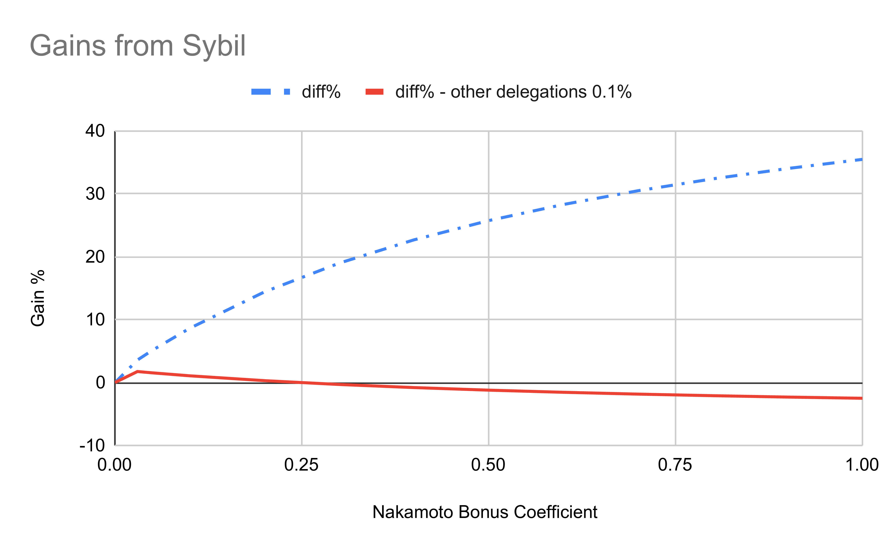

# ADR 004: Nakamoto Bonus 

## Changelog

- 19 May 2025: Initial version
- 22 April 2024: Added Addendum

## Status

DRAFT

## Abstract

The Nakamoto Coefficient is the main way used to measure the amount of decentralization of a blockchain. Many of the benefits of the blockchain technology can be directly attributed to its decentralization: its resilience to attacks, collusion and errors.

The Nakamoto Coefficient is defined as the minimum number of nodes that need to be compromised to harm the network [^1]. In the case of AtomOne (or other Tendermint-based chains), a voting power exceeding 33.3% is enough to disrupt the consensus algorithm, therefore the Nakamoto Coefficient of the chain is the minimum number of validators having such voting power.

This ADR proposes a mechanism to increase the Nakamoto Coefficient of a chain, by incentivizing delegators to delegate on validators having less stake. The ADR proposes to divide the staking reward in two components: a part proportional to the overall amount of stake of a validator - this coincides with the current staking reward model, and a part that is distributed uniformly to validators. The part of the staking reward that is distributed uniformly is called `Nakamoto bonus` to underline its purpose: increasing the Nakamoto Coefficient.

The overall amount of the reward remains unchanged, however the criteria for assigning the reward changes.

## Context

At the time of writing, the AtomOne chain suffers from a concentration of stake to the top validators. The current Nakamoto coefficient is **5**, which is lower that the ideal (34, given that the current maximum number of validators at the time of writing is 100) and harmful to the security of the chain. There are multiple ways in which the issue of low decentralization could be addressed. One way is to incentivize delegators to increase the decentralization of AtomOne which is the aim of this ADR.

### Reward Distribution

The chain reward is distributed across validators using an even distribution weighted by stake. This means that the reward a validator `j` receives after validating block `i` can be computed as follows:

$$
r_{ji} = \frac {x_{ji}}{S_i} \times R_i
$$

Where:

- $r_{ji}$ is the reward of validator $j$ for block $i$.
- $x_{ji}$ is the stake of validator $j$ at block $i$.
- $S_i$ is the total stake across all validators at block $i$.
- $R_i$ is the total reward obtained by validating block $i$.

Additionally, the reward obtained by a validator is further divided using a even distribution weighted by delegation across the delegators. Hence, the reward received by delegator $k$, that delegated his stake to validator $j$ for block $i$ can be computed as:

$$
rd_{ki} = \frac {d_{ki}}{x_{ji}} \times r_{ji}
$$

Where:

- $rd_{ki}$ is the reward obtained by delegator $k$ for block $i$.
- $d_{ki}$ is the stake delegate by delegator $k$ at block $i$.
- $x_{ji}$ is the stake of validator $j$ at block $i$.
- $r_{ji}$ is the reward of validator $j$ for block $i$.

We can define a new metric, `Reward Per Stake (RPS)` as the amount a delegator would be rewarded for unit of stake, and we can compute it as:

$$
RPS_{ji} = \frac{r_{ji}}{x_{ji}}  
$$

Where:

- $RPS_{ji}$ is the reward per stake for validator $j$ for block $i$.
- $r_{ji}$ is the reward of validator $j$ for block $i$.
- $x_{ji}$ is the stake of validator $j$ at block $i$.

In essence, RPS tells us how much a delegator would receive by delegating to validator $j$. 

In the current model, it can easily be seen that RPS is equivalent across all validators and it can be derived from the first equation of this ADR that is equal to:

$$
RPS = \frac{R_{i}}{S{i}}
$$

This means, that from the point of view of a delegator, the decision on which validator to choose has no influence on their expected reward. Therefore, they might as well be delegating their stake to the most established validators.

## The Nakamoto Bonus

In this ADR, we propose to split the reward in two components, proportional reward (PR) and Nakamoto Bonus (NB) such that:

$$
R_i = PR_i + NB_i
$$

Where:
- $R_i$ is the total reward obtained by validating block $i$.
- $PR_i$ is the proportional reward for block $i$.
- $NB_i$ is the Nakamoto Bonus for block $i$.

The reward obtained by a validator $j$ at block $i$ is computed as:

$$
r_{ji} = \frac {x_{ji}}{S_i} \times PR_i + \frac{NB_i}{N_i}
$$

Where:
- $r_{ji}$ is the reward of validator $j$ for block $i$.
- $x_{ji}$ is the stake of validator $j$ at block $i$.
- $PR_i$ is the proportional reward for block $i$.
- $S_i$ is the total stake across all validators at block $i$.
- $NB_i$ is the Nakamoto Bonus for block $i$.
- $N_i$ is the total number of validators for block $i$.

The way the reward obtained by a validator is distributed across its delegators remains unchanged.

If we compute the RPS, as defined before:

$$
RPS_{ji} = \frac{r_{ji}}{x_{ji}}  
$$

It follows that that it is not possible anymore to remove the dependency on the chosen validator as it was without the Nakamoto Bonus.

More specifically, 

$$
RPS_{ji} = \frac{r_{ji}}{x_{ji}} = \frac{PR_i}{S_i} + \frac{NB_i}{N_i \times x_{ji}} 
$$

It can be seen that the first member of the sum of $RPS_{ji}$ is independent from $j$, the specific validator, while the second is inversly proportional to $x_{ji}$ - the stake of validator $j$ at block $i$.

Therefore:

1. The choice of the validator changes the expected reward rate of a delegator.
2. The effect of the Nakamoto Bonus is to reduce RPS in validators having higher stake.

In summary, a delegator is incentivized to delegate its stake to validators with the least stake as their RPS is higher.

### Dynamic change of the $\eta$ parameter

We define a new parameter $\eta \in [0,1]$ that specifies how the Nakamoto Bonus (NB) is computed from the reward:
$NB_i = R_i \times \eta$, where $R_i$ is the total reward obtained by validating block $i$.

Increasing $\eta$ increases the proportion of the reward distributed following the Nakamoto Bonus methodology. Conversely, decreasing $\eta$ increases the proportion of the block reward distributed proportionally to the validators.
The initial value of $\eta$ will be set to `3%`.
The coefficient will be updated every 120K blocks (~ one week) by performing increases or decreases of +- 3%.

The decision on whether $\eta$ needs to be increased or decreased is performed as follows:

1. Bonded validators are sorted by voting power and split into 3 groups (33 in high, 33 in medium, and 34 in low).
2. The average voting power of the high and low validator groups is computed.
3. If the average voting power of the high group is *3x* or more the average voting power of the low group, $\eta$ is increased, otherwise it is decreased.

### Validator Commissions

Unrestricted, validator-set commissions can be used to undermine the mechanisms proposed in this ADR. For example, a top validator could temporarily lower their commission to counteract the effects of the Nakamoto Bonus in the short term.
Moreover, unrestricted commissions may enable validators to exploit delegators. A validator could lower their commission to attract delegations, only to later increase it — potentially up to 100% — for personal gain.
To address this, this ADR proposes that the commission rate become a equal-for-all, network-wide parameter adjustable only through governance. This measure is also mandated by the AtomOne Constitution[^3].

## Consequences

The feature discussed in this ADR rewards delegators who behave in a way beneficial to the decentralization of the AtomOne chain. Delegators who will proactively redelegate their stake considering the state of distribution of voting power can expect a higher staking rewards.

### Positive

- The change in reward system incentivises delegators who increase the decentralization of the chain.

### Negative

- The rewarding mechanism as presented above can be taken advantage of by a sybil attack.

#### Sybil Attack

A validator may profit by adding multiple validators to the chain and splitting its stake across such validators.

In fact, in this scenario assuming $y$ as the number of sybil instances:

$$
r_{ji} = y \times (\frac {x_{ji}}{y \times S_i} \times PR_i + \frac{NB_i}{N_i}) = \frac {x_{ji}}{S_i} \times PR_i + y \times \frac{NB_i}{N_i}
$$

So the validator would keep intact its `Proportional Reward` and be rewarded y times the `Nakamoto Bonus`.

As a separate and additional feature to mitigate sybil attacks, we propose to adopt and adjust the mechanism of `proportional slashing` as presented in ADR-014 [^2] of the Cosmos Hub. 
Two (or more) validators are considered correlated if they fail within the same time period. The correlated validators are then slashed as follows:

$$
slash\_{percentage} = k \times ((power_1)^{(1/r)} + (power_2)^{(1/r)} + ... + (power_n)^{(1/r)})^r 
$$

Where
- $power_j$ refers to the voting power of validator $j$
- $k$ and $r$ are chain specific constants

For example, assuming $k=1$ and $r=2$, if one validator of 10% faults, it gets a 10% slash, while if two validators of 5% each fault together, they both get a 20% slash ($1 \times (0.05^{\frac{1}{2}}+0.05^{\frac{1}{2}})^2$).

`Proportional slashing` is not part of the Nakamoto Bonus feature, and it will be implemented as a separate feature.

### Neutral

- Increased number of distribution parameters.
- Adds a new endpoint to query the value of $\eta$.

[^1]: [Quantifying Decentralization](https://news.earn.com/quantifying-decentralization-e39db233c28e)
[^2]: [ADR-014 - Proportional Slashing](https://github.com/cosmos/cosmos-sdk/blob/main/docs/architecture/adr-014-proportional-slashing.md)
[^3]: [AtomOne Constitution, Article 3, Section 9](https://github.com/atomone-hub/genesis/blob/50882cac6ea4e56b6703d7e3325f35073c75aa6b/CONSTITUTION.md#section-9-validators)

# Addendum

This addendum extends ADR-004 by adding further considerations regarding the Nakamoto Bonus Coefficient and the potential incentivization of Sybil attacks.

## Considerations on the Nakamoto Bonus Coefficient

This section discusses the need to introduce bounds on the Nakamoto Bonus Coefficient as well as adjustments to its rate of change.

### Bounds

In the original ADR, the Nakamoto Bonus Coefficient, denoted by *η*, was defined within the interval [0, 1]. This allowed two extreme cases:
- When *η* = 0: The Nakamoto Bonus is disabled and the entire block reward is distributed proportionally.
- When *η* = 1: The entire block reward is distributed uniformly.
If *η* = 0, the system effectively reverts to having no Nakamoto Bonus. In this case, incentives for delegators to support smaller validators are removed. According to the update rule, *η* decreases when the average voting power of top validators is less than three times that of the bottom validators. If the chain enters such a state, *η* may continue decreasing until reaching zero, even if the distribution of voting power remains far from ideal (i.e., equal across validators). With no incentive remaining for delegators, the chain may stagnate at this suboptimal state.

For this reason, **we propose adding a positive floor value for *η*** to maintain a minimum incentive for delegating to lower-stake validators.

Conversely, simulations suggest that the gains from a Sybil attack scale proportionally with *η*. Although these gains are not sufficient to make such attacks profitable, establishing a maximum cap on *η*—modifiable via governance—is an effective mitigation strategy. **We therefore propose to set an initial cap of 1, with the possibility of adjusting it by governance vote.**

### Rate of Change

In ADR-004, the proposed update rule for *η* allowed changes of ±3% per 120,000 blocks (approximately one week), with *η* initially set at 3%. Under this rule, *η* could reach 9% within two weeks of the feature activation. We believe this rate is too fast for delegators to adjust their strategies to the new reward distribution. Therefore, **we propose reducing the rate of change to ±1%**.
Additionally, to improve predictability, **we recommend defining the update interval in terms of real time (one week) rather than block count**.

## Incentivization of Sybil Attacks

ADR-004 acknowledges that additional mechanisms may be needed to mitigate Sybil attacks. This section quantitatively analyzes the risk posed by such attacks and assesses whether further measures are necessary.

### Methodology

To determine whether Sybil attacks pose a real threat under the Nakamoto Bonus, we must first evaluate whether such attacks are profitable. From a validator’s perspective, a Sybil attack is profitable only if splitting its stake into multiple validators yields higher rewards than operating a single node.

### Optimal Delegation Strategy

Before evaluating Sybil incentives, we must define the optimal delegation strategy under the new reward system. The problem is non-trivial due to non linear terms in the reward formula. The optimal strategy can be expressed as the maximization of the following constrained optimization problem:

$R = \sum_{i=0}^{VN} \left( BR(1 - \eta) \cdot \frac{D_i + V_i}{TS} + \frac{BR \cdot \eta}{VN} \right) \cdot \left( (1 - c) \cdot \frac{D_i}{D_i + V_i} + O_i \cdot c \right)$

Subjected to

$\sum_{i=0}^{VN} D_i \leq TD$

Where:

- R: Delegator’s total reward for the block
- BR: Block reward
- *η*: Nakamoto Bonus Coefficient
- $*D_i*$: Delegations to validator i
- $*V_i:*$ Validator i’s self-stake
- TS: Total stake (sum of all validators’ stakes)
- VN: Number of validators
- c: Commission rate
- $*O_i*$: Ownership flag (1 if the delegator receives commission from validator i, 0 otherwise)
- TD: Total amount delegated

### Quantifying Sybil Benefits

To quantify potential benefits of a Sybil attack, we performed the following procedure:
1. Collected the AtomOne chain’s stake distribution.
2. Selected a target validator.
3. Separated the validator’s self-delegation from external delegations.
4. Computed the optimal reward obtained by reallocating the validator’s self-delegation under two scenarios:
A) No Sybil (baseline)
B) A Sybil node is created that replaces the lowest-ranked validator
5. Compared the resulting rewards.

The chart below presents the most favorable case identified for a Sybil attack.

The x-axis shows *η* ranging from 0 to 1. The y-axis shows the percentage gain from adding a Sybil validator. The dashed blue line represents the scenario in which no delegator responds to the Sybil. For example, if *η* = 0.2, a Sybil would yield a +14.4% reward increase for the attacking validator.

As *η* increases, Sybil gains rise sub-linearly, reaching +35.46% at *η* = 1. At first glance, this seems to indicate that a Sybil attack is profitable.

However, the full red line models a more realistic scenario in which other delegators shift 0.1% of their stake to the Sybil, since the Sybil validator becomes the most favorable choice for delegators. Under this assumption, the validator’s Sybil-related profit margin rapidly shrinks and can even become negative.

**Conclusion:**
While a validator may experience a brief instantaneous benefit right after creating a Sybil, the advantage disappears once other delegators redistribute their stakes. Even if operational costs are not considered (which are not included in this analysis), and even in the most favorable scenarios, maintaining a Sybil is unprofitable. For this reason, **no additional mechanism is required to prevent Sybil attacks.**
